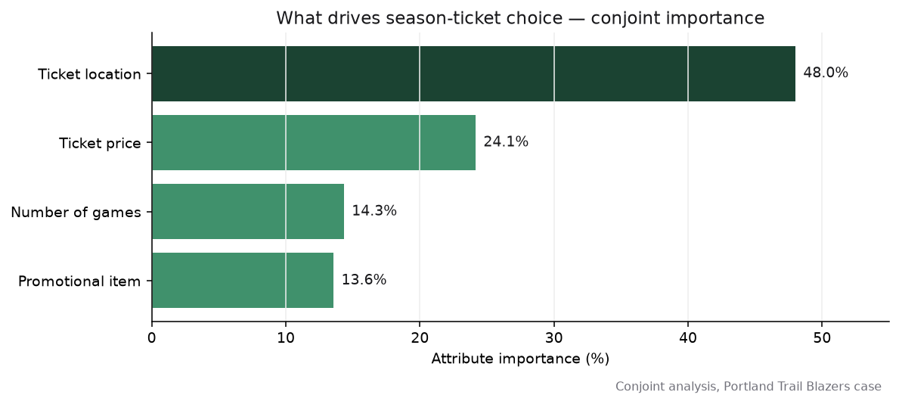

# PortlandBlazers — Conjoint Analysis for Season-Ticket Pricing

After a rough 2005 season, the Portland Trail Blazers faced declining attendance. What do fans actually value in a season-ticket package, and how should the team price and bundle it? This project answers that with conjoint analysis.

## At a glance

| | |
|---|---|
| **Role** | Analyst (marketing analytics, conjoint / pricing) |
| **Stack** | Conjoint analysis, Excel |
| **Data** | Conjoint utility scores across ticket attributes and levels |
| **Context** | UC Riverside MSBA (MGT 251) |
| **Key result** | **Ticket location is the most important attribute (~48%)**, ahead of price (~24%); recommends location-first packaging plus a low-cost, high-utility promo |

## Problem & context

Attendance was falling and perception was weak. Rather than guess, the team can measure how fans trade off the pieces of a ticket package, number of games, price, seat location, and promotional item, and design offers around what matters most.

## Approach

- **Attribute importance:** computed the range of part-worth utilities for each attribute; the wider the range, the more it drives choice.
- **Package evaluation:** scored candidate packages by total utility and by **utility per dollar** to balance appeal and profitability.
- **Promo assessment:** compared promotional items by utility contribution versus cost.

## Key findings

- **Ticket location dominates (~48% importance)**, then price (~24%), number of games (~14%), and promotional item (~14%). Seat position is the biggest lever.
- **6-game packages** aligned with both management preference and high utility.
- The **"hot dog and soda" promo** added meaningful utility (~3.9%) at low cost, the most cost-effective giveaway; playoff-ticket priority also scored well.
- **Combination 1 delivered the highest utility per dollar**, making it the recommended lead offer.

## Repo guide

- `Portland Blazers Detailed analysis.pdf` — the full conjoint write-up and pricing logic.
- `Portland Trail Blazers Utilities.xlsx` — attribute and level utility scores.
- `Portland Trail Blazer - PPT Presentation.pdf` — slides.
- `assets/hero.png` — attribute-importance chart from the conjoint results.

**Reproduce:** the utilities workbook holds the part-worths; attribute importance is the range of each attribute's utilities, normalized across attributes.

---

Tools: conjoint analysis · Excel · pricing strategy
Part of my portfolio → https://visheshshukla.netlify.app

_Team academic project (UC Riverside MSBA). Classroom case data._
